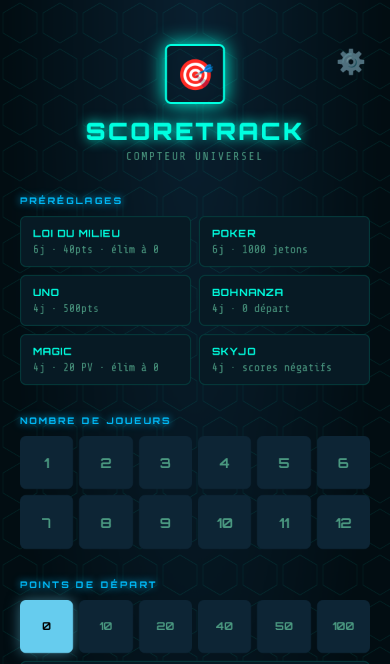
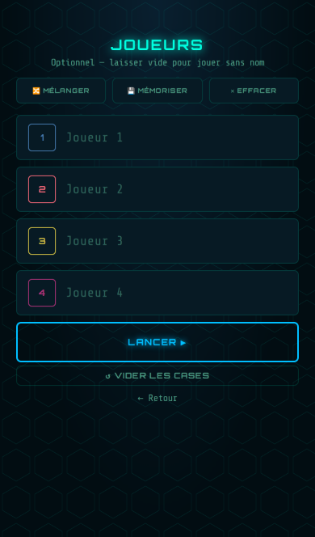
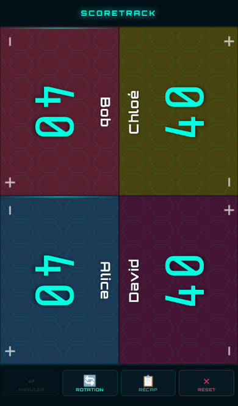
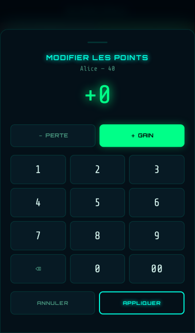
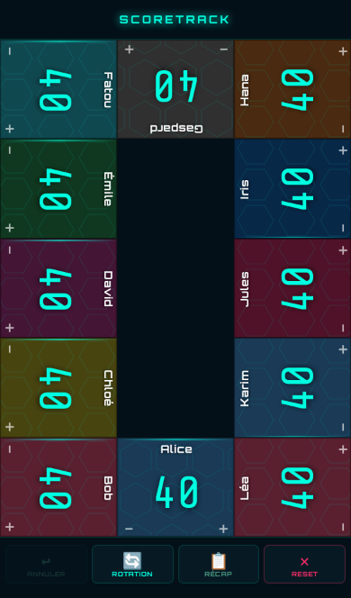
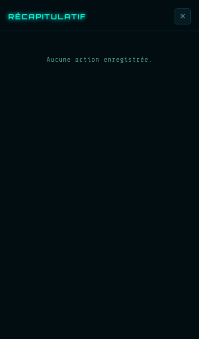
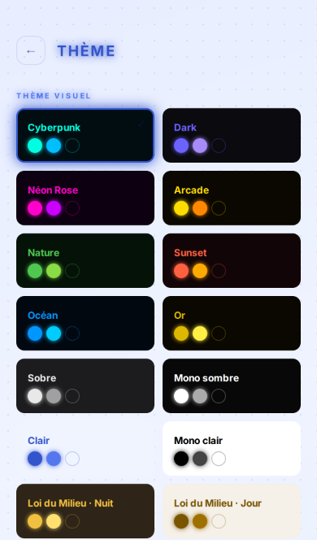
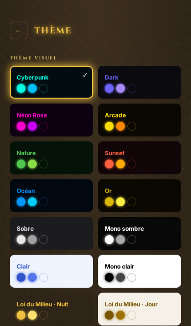

# ScoreTrack

Compteur de scores universel pour jeux de société et de cartes, de 1 à 12 joueurs. Application web
progressive (PWA) **hors ligne**, **sans compte** et **sans aucune collecte de données** : tout
reste sur l'appareil. Interface en français, pensée pour être posée au milieu de la table et lue à
un mètre.

|                                           Réglage de la partie                                           |                              Joueurs                              |                              Écran de jeu (4 joueurs)                               |                              Pavé numérique                               |
| :------------------------------------------------------------------------------------------------------: | :---------------------------------------------------------------: | :---------------------------------------------------------------------------------: | :-----------------------------------------------------------------------: |
|  |  |  |  |

|                         12 joueurs                         |                         Récapitulatif                          |                 Thème clair                 |                   Thème Loi du Milieu                   |
| :--------------------------------------------------------: | :------------------------------------------------------------: | :-----------------------------------------: | :-----------------------------------------------------: |
|  |  |  |  |

_Captures Playwright (iPhone 13 émulé) prises le 16 septembre 2026 après la restructuration ;
elles sont régénérées à chaque évolution visuelle notable._

## Fonctionnalités

- **Cartes orientées vers chaque joueur** : tap sur la moitié `+` ou `−`, appui long = pavé
  numérique (gain ou perte), grille sans cellule vide de 1 à 12 joueurs, rotation des sièges.
- **Règles** : points de départ, points maximum (fin de partie et vainqueur à l'atteinte),
  scores négatifs autorisés ou non, élimination à 0 avec confirmation, vainqueur = dernier
  survivant.
- **Préréglages** : Loi du Milieu, Poker, Uno, Bohnanza, Magic, Skyjo ; défauts personnalisables.
- **Historique** : annulation par action (les taps rapprochés forment une action), appui long
  pour répéter, récapitulatif par joueur.
- **Reprise** : la partie en cours est sauvegardée à chaque action et proposée au retour ; une
  sauvegarde abîmée n'est jamais effacée sans votre accord (la précédente est proposée).
- **14 thèmes**, palette de joueurs adaptée aux daltoniens (Paul Tol), gains et pertes toujours
  signalés par un glyphe en plus de la couleur, contraste AA, `prefers-reduced-motion` respecté.
- **Hors ligne complet** grâce au service worker ; mise à jour signalée par une bannière, jamais
  imposée en pleine partie.
- **Vie privée** : aucune requête vers un tiers (polices auto-hébergées), aucun cookie, export et
  import de vos données en JSON, politique de confidentialité intégrée.

## Installer l'application (PWA)

- **Android / Chrome** : menu ⋮ → « Installer l'application » (ou la bulle d'installation).
- **iPhone / Safari** : bouton Partager → « Sur l'écran d'accueil ». Une fois installée, iOS
  protège le stockage local contre l'effacement automatique.
- **Ordinateur / Chrome, Edge** : icône d'installation à droite de la barre d'adresse.

Première ouverture en ligne obligatoire (téléchargement ≈ 650 Ko, polices comprises) ; ensuite
l'application fonctionne sans réseau.

## Développement

Prérequis : Node 22 et npm 10. Aucune dépendance n'est nécessaire pour **servir** l'application
(D2) ; l'outillage ne sert qu'à vérifier.

```bash
npm ci                 # outillage de dev uniquement
npm run dev            # http://localhost:8765/ (serveur statique)
npm run check          # lint + précache SW à jour + tests unitaires + tests e2e
```

| Commande            | Rôle                                                                                                                                  |
| ------------------- | ------------------------------------------------------------------------------------------------------------------------------------- |
| `npm run lint`      | ESLint + Prettier (`npm run format` pour corriger)                                                                                    |
| `npm run build:sw`  | régénère la liste de précache et le hash de version de `sw-st.js` — **obligatoire après tout ajout ou modification de fichier servi** |
| `npm run check:sw`  | vérifie que `sw-st.js` est à jour                                                                                                     |
| `npm run test:unit` | Vitest (logique pure de `js/core`)                                                                                                    |
| `npm run test:e2e`  | Playwright (Chromium émulant un iPhone 13 tactile)                                                                                    |
| `npm run lhci`      | Lighthouse CI avec le budget de `lighthouserc.json`                                                                                   |
| `npm run audit`     | `npm audit --omit=dev` (il n'y a aucune dépendance de production)                                                                     |

Conventions (détail dans [CONTRIBUTING.md](CONTRIBUTING.md)) : interface, documentation et
commits en français ; identifiants de code en anglais ; `npm run check` vert avant tout commit.

## Structure du dépôt

```
index.html            coquille HTML (aucun script inline, CSP en meta)
sw-st.js              service worker (précache généré, nom figé)
manifest-st.json      manifest PWA (nom figé)
css/                  fonts, tokens, themes, base, setup, game, modals, motion, system
js/main.js            amorçage et table des actions data-action
js/core/              logique pure sans DOM (règles, historique, placements, schéma de sauvegarde)
js/ui/                écrans et modales (DOM), icônes SVG, accessibilité
js/platform/          localStorage atomique, service worker, journal d'erreurs, haptique, export/import
js/fx/                animations
assets/fonts/         polices auto-hébergées (OFL, voir assets/fonts/LICENSES.md)
assets/icons/, icons/ icônes SVG de l'interface, icônes PWA
scripts/              génération (précache SW, icônes, polices, audits contraste/CVD)
tests/unit, tests/e2e Vitest et Playwright
docs/                 architecture, décisions, exploitation, sécurité, rapport d'audit
.github/              CI, déploiement Pages, Dependabot
```

Documentation : [Architecture](docs/ARCHITECTURE.md) · [Décisions](docs/DECISIONS.md) ·
[Exploitation](docs/EXPLOITATION.md) · [Sécurité](docs/SECURITE.md) ·
[Audit 2026-09](docs/AUDIT-2026-09.md) · [Changelog](CHANGELOG.md).

## Déploiement

Le dépôt est servable **tel quel** depuis sa racine : aucun build.

- **Recommandé** : GitHub → Settings → Pages → Source : **« GitHub Actions »**. Le workflow
  [`deploy-pages.yml`](.github/workflows/deploy-pages.yml) se déclenche à chaque push sur `master`
  (ou manuellement) : il vérifie lint, précache et tests unitaires, empaquette le dépôt sans
  `node_modules`, `tests`, `docs`, `scripts` ni fichiers de configuration dans `dist/`, puis publie.
  Aucun secret n'est requis.
- **Alternative** : Source « Deploy from a branch » sur `master` / racine fonctionne aussi (D2) ;
  les fichiers d'outillage seront alors publiés avec l'application, sans effet sur son
  fonctionnement.
- Tout autre hébergeur statique convient (copier le contenu de `dist/` ou du dépôt). HTTPS est
  obligatoire pour le service worker et l'installation.

La CI ([`ci.yml`](.github/workflows/ci.yml)) tourne sur chaque push et PR : lint, tests unitaires
avec couverture, tests e2e avec traces en cas d'échec, Lighthouse avec budget, audit des dépendances.

## Confidentialité

Aucune donnée ne quitte l'appareil : pas de serveur, pas d'analytics, pas de CDN, pas de cookie.
Les préférences, la partie en cours et les prénoms mémorisés sont dans le `localStorage` du
navigateur et peuvent être exportés, importés ou supprimés depuis l'application.

## Licence

**À définir par le propriétaire.** Aucune licence n'a encore été choisie : sauf mention contraire,
tous droits réservés (`package.json` : `UNLICENSED`). Les options (MIT ou propriétaire) et leurs
conséquences sont documentées dans [docs/DECISIONS.md](docs/DECISIONS.md) (ADR-17). Les polices
embarquées sont sous SIL Open Font License 1.1 (voir `assets/fonts/LICENSES.md`).
