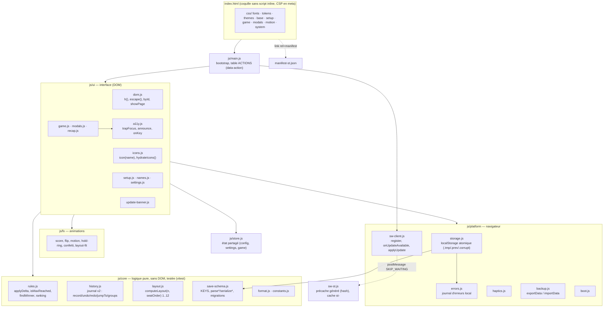
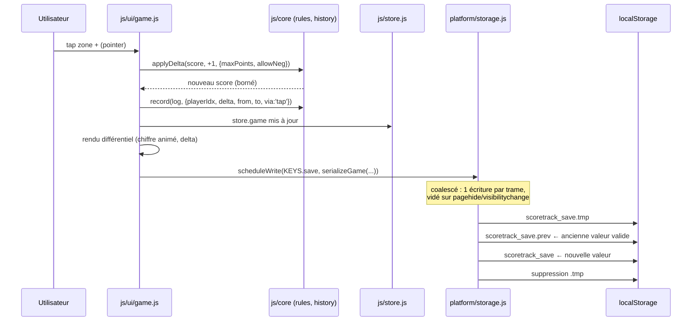
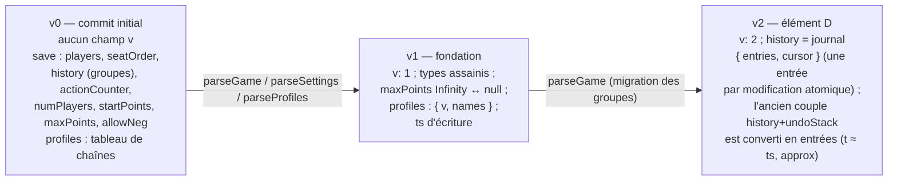
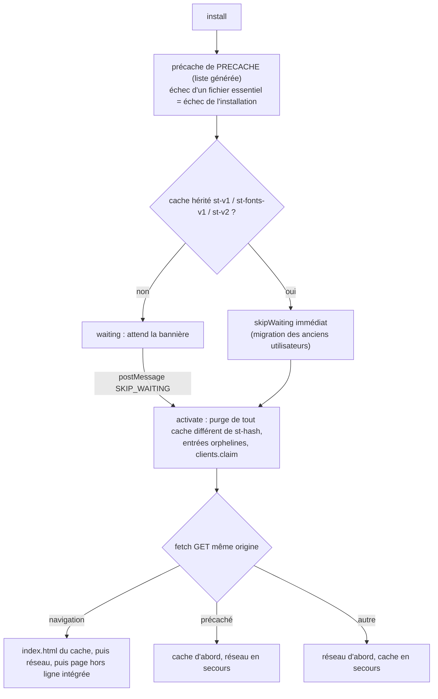

# Architecture

ScoreTrack est une PWA statique : HTML + CSS + modules ES natifs, **zéro dépendance à l'exécution,
zéro bundler** (D2). Le dépôt est servable tel quel depuis sa racine ; l'outillage npm ne sert qu'au
lint, aux tests et aux scripts de génération.

## 1. Vue d'ensemble des modules

Règles de dépendance : `core` n'importe rien d'autre que `core` ; `platform` n'importe que `core` ;
`ui` importe tout ; `main.js` ne contient que le câblage. Aucun module n'écrit dans `localStorage`
autrement que par `platform/storage.js`.

## 2. Flux d'état

- **Une seule source de vérité** : `store` (config de partie, réglages, partie en cours). Les
  écrans lisent `store` et ne gardent pas d'état dupliqué.
- **Actions déclaratives** : chaque bouton porte `data-action="…"`, résolu par la table `ACTIONS`
  de `main.js` (un seul écouteur `click` délégué). Aucun `onclick` inline (CSP `script-src 'self'`).
- **Annulation** : journal chronologique v2 (`history.js`) ; `undo` recule d'une _action_ (un
  groupe de taps rapprochés, `GROUP_DELAY = 1500 ms`) et renvoie l'entrée inversée que l'UI
  applique ; `redo` jusqu'au prochain `record`. Plus d'instantanés JSON.
- **Fin de partie** : `findWinner(players, {maxPoints, startPoints})` → `{ index, reason }` avec
  `reason` = `last-alive` (élimination à 0) ou `max-reached` (D : correction du défaut P0 n° 3).
- **Rétablissement et retour en arrière** : `redo(log)` et `jumpTo(log, entryId)` sont appelés par
  `js/ui/game.js` ; `ranking(players)` alimente le récapitulatif.

## 3. Schéma de sauvegarde (localStorage)

| Clé                       | Contenu                                         | Depuis |
| ------------------------- | ----------------------------------------------- | ------ |
| `scoretrack_settings`     | thème, défauts (joueurs, départ, max, négatifs) | v0     |
| `scoretrack_save`         | partie en cours                                 | v0     |
| `scoretrack_profiles`     | prénoms mémorisés (≤ 30)                        | v0     |
| `scoretrack_save.tmp`     | écriture en cours (transitoire)                 | v2     |
| `scoretrack_save.prev`    | dernière sauvegarde valide précédente           | v2     |
| `scoretrack_save.corrupt` | sauvegarde illisible mise en quarantaine        | v2     |
| `scoretrack_errors`       | journal d'erreurs local (≤ 20 entrées)          | v2     |

### Versions du format

Règles (D5) :

- La lecture accepte **toutes** les versions antérieures (`parse*` sans effet de bord) ; l'écriture
  produit toujours la version courante (`serialize*`). Une sauvegarde v0 lue puis réécrite devient
  vN sans perdre la partie.
- Une sauvegarde inexploitable n'est **jamais supprimée en silence** : elle est déplacée dans
  `.corrupt`, la dernière valide (`.prev`) est proposée à la reprise.
- Les fixtures `tests/unit/fixtures/v0-*.json` et `v1-save.json` figent les formats historiques ;
  toute évolution du schéma ajoute une fixture et un test de migration.
- Export/import (`platform/backup.js`) : enveloppe `{ app:'scoretrack', v, exportedAt, settings,
save, profiles }`, validée en bloc avant toute écriture.

## 4. Service worker (`sw-st.js`, nom figé — D3)

- `PRECACHE` et `VERSION` (8 hexadécimaux, SHA-256 du contenu de tous les fichiers servis) sont
  écrits par `npm run build:sw` ; `npm run check:sw` échoue en CI si la liste est périmée. Tout
  changement de fichier servi change donc le nom de cache `st-<hash>` et déclenche une mise à jour.
- Côté page, `sw-client.js` détecte le SW en attente (`updatefound` → `installed` avec un
  contrôleur actif) et `update-banner.js` affiche « Nouvelle version disponible — Mettre à jour » ;
  `applyUpdate()` envoie `SKIP_WAITING` puis recharge sur `controllerchange`, la partie étant déjà
  sauvegardée (aucune perte).
- Le manifest garde son nom (`manifest-st.json`), déclare `id`, `scope`, `lang`, icônes 192/512
  et maskable.

## 5. Rendu et mouvement

- Grille de cartes calculée par `layout.js` (1..12 joueurs, aucune cellule vide, aire perdue
  ≤ 10 %), chaque carte orientée vers son joueur.
- Tokens de mouvement dans `css/tokens.css` (`--dur-1/2/3`, `--ease-out`, `--ease-spring`) ;
  `css/motion.css` neutralise les animations sous `prefers-reduced-motion: reduce` (D7).
- Couleurs joueurs : palette Paul Tol (D1) ; sémantique gain/perte `--gain`/`--loss` (bleu/orange)
  toujours doublée d'un glyphe `+`/`−`.
- Icônes : SVG inline `currentColor` via `icons.js` ; les emojis présents dans `index.html` sont
  des textes de secours remplacés au chargement (`hydrateIcons`).

## 6. Décisions structurantes (rappel)

| N°  | Décision                                                                           |
| --- | ---------------------------------------------------------------------------------- |
| D1  | Palette daltonien-safe ; toute couleur doublée d'un signe non chromatique          |
| D2  | Zéro dépendance runtime, zéro bundler ; dépôt servable tel quel                    |
| D3  | Noms `sw-st.js` / `manifest-st.json` figés ; purge des anciens caches              |
| D4  | Aucune donnée ne quitte l'appareil ; polices auto-hébergées ; ni CDN ni analytics  |
| D5  | Clés localStorage existantes toujours lisibles ; migrations versionnées            |
| D6  | UI, docs, commits en français ; identifiants en anglais                            |
| D7  | `user-scalable=no` conservé en jeu ; tailles minimales et reduced-motion respectés |
| D8  | Référence de qualité : meilleur compteur du marché (tactile, 1 m, 60 fps, AA)      |
| D9  | Aucune donnée fictive ; aucun identifiant de modèle IA dans code, commits, docs    |

Le journal complet, avec contexte et conséquences, est dans [DECISIONS.md](DECISIONS.md).

## 7. Outillage

| Commande                 | Rôle                                                                                        |
| ------------------------ | ------------------------------------------------------------------------------------------- |
| `npm run dev`            | serveur statique local sur la racine (port 8765)                                            |
| `npm run lint`           | ESLint + Prettier + anti-emoji                                                              |
| `npm run build:sw`       | régénère `PRECACHE`/`VERSION` de `sw-st.js` (obligatoire après tout ajout de fichier servi) |
| `npm run check:sw`       | vérifie que `sw-st.js` est à jour                                                           |
| `npm run test:unit`      | vitest (`tests/unit`, logique pure)                                                         |
| `npm run test:e2e`       | Playwright, Chromium émulant un iPhone 13 tactile                                           |
| `npm run check`          | lint + check:sw + unit + e2e — obligatoire avant tout commit                                |
| `npm run build:dist`     | construit `dist/` : le dépôt moins l'outillage, exactement ce qui est publié                |
| `npm run serve:dist`     | sert `dist/` sur le port 8765 (pour les audits ci-dessous)                                  |
| `npm run lhci`           | Lighthouse CI sur `dist/` + budget de `lighthouserc.json`                                   |
| `npm run audit:contrast` | contraste AA des 14 thèmes (serveur local requis) — échoue en cas de régression             |
| `npm run audit:cvd`      | lisibilité en protanopie, deutéranopie, tritanopie — idem                                   |
| `npm run audit`          | `npm audit --omit=dev` (aucune dépendance de production)                                    |

La CI (`.github/workflows/ci.yml`) exécute ces mêmes vérifications en sept jobs parallèles ; le job
`paquet` construit `dist/`, vérifie qu'aucun fichier d'outillage n'y figure, que chaque entrée du
précache y existe, et que le poids téléchargé à la première visite reste sous
`PRECACHE_MAX_BYTES`.

## 8. Poids et chiffres

Ordres de grandeur mesurés le 17 septembre 2026, alors que les éléments A et D travaillaient encore :
chaque ligne indique la commande qui les reproduit, à relancer avant toute publication.

| Élément                       | Valeur                                        | Comment la reproduire                                         |
| ----------------------------- | --------------------------------------------- | ------------------------------------------------------------- |
| Coquille `index.html`         | ≈ 24 Ko                                       | `stat -c%s index.html`                                        |
| Paquet publié `dist/`         | 66 fichiers, ≈ 840 Kio                        | `npm run build:dist && du -sb dist`                           |
| Précache du service worker    | 61 entrées, ≈ 640 Ko (dont 238 Ko de polices) | job `paquet` de la CI (plafond `PRECACHE_MAX_BYTES`)          |
| Chargement initial de la page | ≈ 400 Kio                                     | audit Lighthouse `total-byte-weight` (plafond 512 000 octets) |

Le précache et le chargement initial diffèrent : la page n'a besoin que d'une partie des fichiers
pour s'afficher, le service worker télécharge le reste en arrière-plan pour le mode hors ligne.

Ne sont **pas** précachées : les deux captures déclarées dans `manifest-st.json`
(`assets/screenshots/`, 218 Ko) — elles ne servent qu'à la fiche d'installation du navigateur, qui
n'est consultée qu'en ligne ; et `favicon.png` à la racine, qu'aucune page ne référence
(`index.html` pointe `icons/icon-192.png`).
